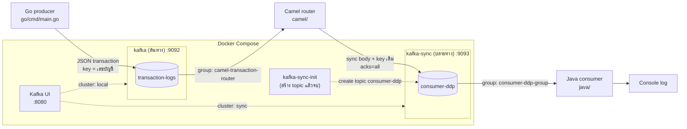
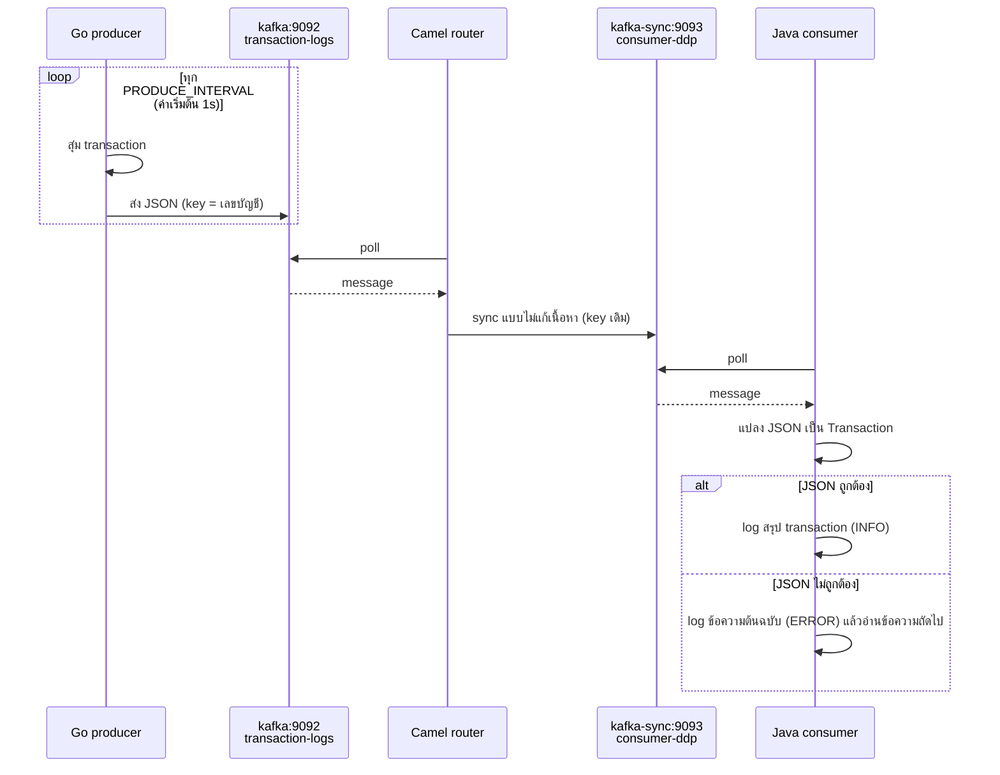

# camel-sample

ตัวอย่างระบบส่งต่อ transaction ของธนาคารผ่าน Kafka โดยใช้ Apache Camel sync ข้อความจาก Kafka cluster หนึ่งไปอีก cluster หนึ่ง

- **Go producer** จำลอง transaction ของธนาคาร แล้วส่งเข้า topic `transaction-logs` บน cluster ต้นทาง `kafka` (port 9092)
- **Camel router** อ่านจาก `transaction-logs` แล้ว sync ไปที่ topic `consumer-ddp` บน cluster ปลายทาง `kafka-sync` (port 9093)
- **Java consumer** (Camel) อ่านจาก `consumer-ddp` บน `kafka-sync` แล้ว print log ของแต่ละ transaction

## แผนภาพการทำงาน



ลำดับการทำงานของ 1 transaction:



## โครงสร้างโปรเจกต์

```
.
├── docker-compose.yml      # kafka (ต้นทาง) + kafka-sync (ปลายทาง) + Kafka UI
├── clear-message.sh        # ลบ message ใน topic ทั้งสอง cluster
├── go/                     # Producer
│   └── cmd/main.go
├── camel/                  # Router: kafka/transaction-logs -> kafka-sync/consumer-ddp
│   └── src/main/java/com/yuttasak/camel/
│       ├── Application.java
│       └── TransactionRouterRoute.java
└── java/                   # Consumer: kafka-sync/consumer-ddp -> log
    └── src/main/java/com/yuttasak/ddp/
        ├── Application.java
        ├── Transaction.java
        └── TransactionConsumerRoute.java
```

## รายละเอียดแต่ละส่วน

### 1. Kafka + Kafka UI (`docker-compose.yml`)

ทั้งสอง Kafka ใช้ `apache/kafka:4.0.0` ในโหมด KRaft ไม่ต้องใช้ Zookeeper และเป็นคนละ cluster กัน ข้อมูลไม่ได้แชร์กัน

| Service | ต่อจาก host | ต่อจาก container ใน compose | Volume | หมายเหตุ |
|---|---|---|---|---|
| kafka | `localhost:9092` | `kafka:29092` | `kafka-data` | cluster ต้นทาง มี topic `transaction-logs` สร้าง topic อัตโนมัติเมื่อมีคนส่งเข้ามา |
| kafka-sync | `localhost:9093` | `kafka-sync:29092` | `kafka-sync-data` | cluster ปลายทาง มี topic `consumer-ddp` **ปิด**การสร้าง topic อัตโนมัติ |
| kafka-sync-init | - | - | - | รันครั้งเดียวหลัง kafka-sync พร้อม สร้าง topic `consumer-ddp` (1 partition) แล้วจบการทำงาน ถ้ามี topic อยู่แล้วจะไม่ทำอะไร |
| kafka-ui | http://localhost:8080 | - | - | ดูได้ทั้งสอง cluster: `local` (kafka) และ `sync` (kafka-sync) |

`kafka-sync` ปิดการสร้าง topic อัตโนมัติไว้ เพื่อให้ topic มีแค่ที่กำหนดไว้ ถ้าตั้ง topic ปลายทางผิด Camel จะ error แทนที่จะสร้าง topic ใหม่ขึ้นมาเอง

หลัง `docker compose up -d` สถานะของ `kafka-sync-init` จะเป็น `Exited (0)` ซึ่งถือว่าปกติ

### 2. Go producer (`go/`)

สุ่ม transaction แล้วส่งเข้า `transaction-logs` ตามรอบเวลาที่ตั้งไว้ ใช้ library `segmentio/kafka-go`

ตัวอย่าง message:

```json
{
  "transactionId": "b09d51a6-dc68-4c2d-8305-1edc9daa5dc9",
  "type": "WITHDRAW",
  "fromAccount": "678-9-01234-5",
  "amount": 35236.46,
  "currency": "THB",
  "channel": "ATM",
  "status": "SUCCESS",
  "timestamp": "2026-10-03T09:42:07.050483Z"
}
```

| Field | ค่าที่เป็นไปได้ |
|---|---|
| `type` | `DEPOSIT` (มีแค่ `toAccount`), `WITHDRAW` / `PAYMENT` (มีแค่ `fromAccount`), `TRANSFER` (มีทั้งสองบัญชี และเป็นคนละบัญชีกัน) |
| `channel` | `MOBILE`, `ATM`, `BRANCH`, `INTERNET` |
| `status` | `SUCCESS` (ออกบ่อยที่สุด), `FAILED`, `PENDING` |
| `amount` | 1.00 – 50,000.99 THB |

- ใช้เลขบัญชีเป็น key ของ message ข้อความของบัญชีเดียวกันจึงเข้า partition เดียวกันและเรียงลำดับถูกต้อง
- รอให้ Kafka ยืนยันการรับครบก่อน (`RequireAll`)
- รองรับ graceful shutdown: เมื่อได้รับ Ctrl+C หรือ SIGTERM จะหยุดสร้างข้อความใหม่ รอข้อความที่กำลังส่งให้เสร็จ แล้วปิดการเชื่อมต่อ ภายใน `SHUTDOWN_TIMEOUT` ถ้ากด Ctrl+C ซ้ำจะบังคับปิดทันที

### 3. Camel router (`camel/`)

ใช้ Apache Camel 4.18.4 route `transaction-logs-to-consumer-ddp` ทำงานดังนี้

1. อ่านข้อความจาก `transaction-logs` บน `kafka` (`localhost:9092`)
2. log ตำแหน่ง partition, offset และ key
3. ส่งต่อไป `consumer-ddp` บน `kafka-sync` (`localhost:9093`) แบบไม่แก้เนื้อหาและใช้ key เดิม โดยรอให้ Kafka ยืนยันการรับครบ (`requestRequiredAcks=all`)

ตั้ง broker ต้นทางและปลายทางแยกกันใน `camel/src/main/resources/application.properties` (`kafka.source-brokers`, `kafka.target-brokers`)

ถ้าส่งไม่สำเร็จจะลองใหม่ 3 ครั้ง ห่างกันครั้งละ 1 วินาที

### 4. Java consumer (`java/`)

ใช้ Apache Camel 4.18.4 route `consume-ddp-transactions` ทำงานดังนี้

1. อ่านข้อความจาก `consumer-ddp` บน `kafka-sync` (`localhost:9093`)
2. แปลง JSON เป็น record `Transaction` ด้วย Jackson ถ้ามี field อื่นที่ไม่รู้จักจะข้ามไป
3. log สรุป transaction 1 บรรทัด

```
partition=0 offset=45 key=678-9-01234-5 | dc20bb6b-... DEPOSIT     34,393.39 THB | from=- to=678-9-01234-5 | ATM      SUCCESS | 2026-10-03T09:42:07Z
```

ถ้าข้อความไม่ใช่ JSON ที่ถูกต้อง จะ log เป็น ERROR พร้อมข้อความต้นฉบับ แล้วอ่านข้อความถัดไปต่อ ไม่หยุดทำงาน

## วิธีรัน

### สิ่งที่ต้องมี

- Docker และ Docker Compose
- Go 1.24 ขึ้นไป
- Java 21 ขึ้นไป (ไม่ต้องติดตั้ง Maven เพราะในโปรเจกต์มี `./mvnw` ให้แล้ว)

### ขั้นตอน

**1. เปิด Kafka ทั้งสอง cluster และ Kafka UI**

```bash
docker compose up -d
docker compose ps -a   # kafka, kafka-sync = healthy, kafka-sync-init = Exited (0)
```

**2. เปิด Camel router** (terminal 1)

```bash
cd camel
./mvnw compile exec:java
```

**3. เปิด Java consumer** (terminal 2)

```bash
cd java
./mvnw compile exec:java
```

**4. เปิด Go producer** (terminal 3)

```bash
cd go
go run ./cmd
```

หลังจากนั้น terminal 1 จะเห็น log `move ... -> localhost:9093/consumer-ddp` และ terminal 2 จะเห็น log สรุป transaction

**5. ดูข้อความผ่าน Kafka UI**

เปิด http://localhost:8080 แล้วเลือก cluster
- `local` → Topics → `transaction-logs`
- `sync` → Topics → `consumer-ddp`

**6. ลบ message ใน topic** (ถ้าต้องการเริ่มทดสอบใหม่)

```bash
./clear-message.sh                  # ลบใน transaction-logs (kafka) และ consumer-ddp (kafka-sync)
./clear-message.sh transaction-logs # ลบเฉพาะ topic ที่ระบุ
```

- สคริปต์หา topic ในทุก cluster (`kafka` และ `kafka-sync`) แล้วลบในทุกที่ที่พบ
- ถ้า container ไหนไม่ได้รันอยู่จะแจ้งเตือนแล้วทำกับตัวที่เหลือต่อ
- กำหนด container เองได้ผ่าน `KAFKA_CONTAINERS="kafka kafka-sync"`
- ลบเฉพาะ message ส่วนตัว topic และการตั้งค่ายังอยู่ message ใหม่จะได้ offset ต่อจากเดิม

**7. ปิดระบบ**

กด Ctrl+C ในแต่ละ terminal แล้วรัน

```bash
docker compose down      # ปิด Kafka ทั้งสอง cluster
docker compose down -v   # ปิด และลบข้อมูลทั้งหมด (ครั้งถัดไป kafka-sync-init จะสร้าง consumer-ddp ให้ใหม่)
```

## การตั้งค่าผ่าน environment variable

| ส่วน | ตัวแปร | ค่าเริ่มต้น |
|---|---|---|
| Go producer | `KAFKA_BROKER` | `localhost:9092` |
| | `PRODUCE_INTERVAL` | `1s` (รูปแบบ Go duration เช่น `200ms`, `5s`) |
| | `SHUTDOWN_TIMEOUT` | `10s` (เวลาสูงสุดที่รอส่งข้อความค้างให้เสร็จตอนปิดโปรแกรม) |
| Camel router | `KAFKA_SOURCE_BROKERS` | `localhost:9092` (kafka) |
| | `KAFKA_SOURCE_TOPIC` | `transaction-logs` |
| | `KAFKA_GROUP_ID` | `camel-transaction-router` (group บน kafka ต้นทาง) |
| | `KAFKA_TARGET_BROKERS` | `localhost:9093` (kafka-sync) |
| | `KAFKA_TARGET_TOPIC` | `consumer-ddp` |
| Java consumer | `KAFKA_BROKERS` | `localhost:9093` (kafka-sync) |
| | `KAFKA_TOPIC` | `consumer-ddp` |
| | `KAFKA_GROUP_ID` | `consumer-ddp-group` |

topic `transaction-logs` ของ Go producer กำหนดไว้ในโค้ด (`const topic`) เปลี่ยนผ่าน env ไม่ได้

ตัวอย่าง:

```bash
PRODUCE_INTERVAL=200ms go run ./cmd
# ให้ Java อ่านจาก Go ตรงๆ โดยไม่ผ่าน Camel (ต้องชี้ไปที่ kafka ต้นทางด้วย)
KAFKA_BROKERS=localhost:9092 KAFKA_TOPIC=transaction-logs ./mvnw compile exec:java
```

## ข้อควรรู้

- **อ่านจากข้อความแรกสุด:** ทั้ง Camel และ Java ตั้ง `auto-offset-reset = earliest` ตอนรันครั้งแรก (หรือเปลี่ยน group id) จึงอ่านข้อความเก่าทั้งหมดใน topic ถ้าต้องการอ่านเฉพาะข้อความใหม่ ให้เปลี่ยนเป็น `latest` ใน `application.properties`
- **ข้อความอาจซ้ำได้:** Camel router ไม่ได้ป้องกันข้อความซ้ำ ถ้าโปรแกรมหยุดกลางทาง ข้อความบางรายการอาจถูกส่งไป `consumer-ddp` ซ้ำ ถ้าห้ามซ้ำเด็ดขาด ต้องเปลี่ยนให้ยืนยันการอ่านด้วยตัวเอง (manual commit) หรือใช้ Kafka transaction
- **รันใน container:** ถ้าจะรันโปรแกรมเหล่านี้เป็น container ใน compose เดียวกัน ให้ตั้ง broker ต้นทางเป็น `kafka:29092` และปลายทางเป็น `kafka-sync:29092`
- **Offset ไม่ตรงกันระหว่างสอง cluster:** `consumer-ddp` เป็นคนละ cluster กับ `transaction-logs` จึงนับ offset ของตัวเอง เช่น `transaction-logs` offset 59 อาจกลายเป็น `consumer-ddp` offset 1 ให้ใช้ `transactionId` เพื่อจับคู่ข้อความ
